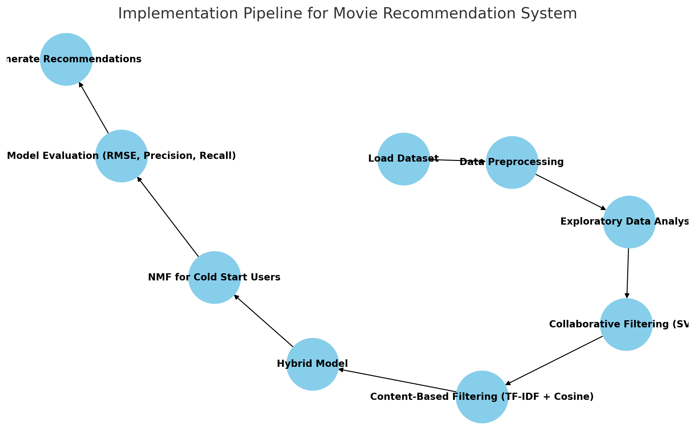

# Movie_Recommendation_System
The goal of this project is to build a Movie Recommendation System that personalizes recommendations based on user preferences

With the vast number of movies available on streaming platforms, users often struggle to find content suited to their tastes. This project leverages collaborative filtering, content-based filtering, and hybrid models to enhance user experience and engagement.

The recommendation system is being developed using the MovieLens dataset, which contains user-movie interaction data, including ratings, genres, and timestamps. The system aims to address scalability, personalization, diversity, transparency, and cold-start challenges while optimizing recommendation quality.

